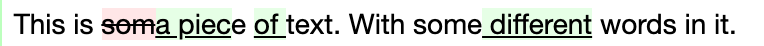
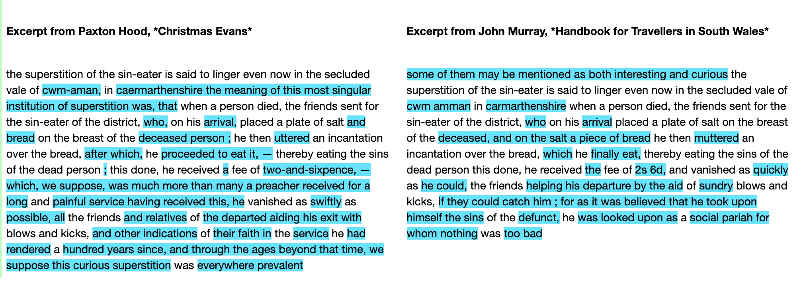
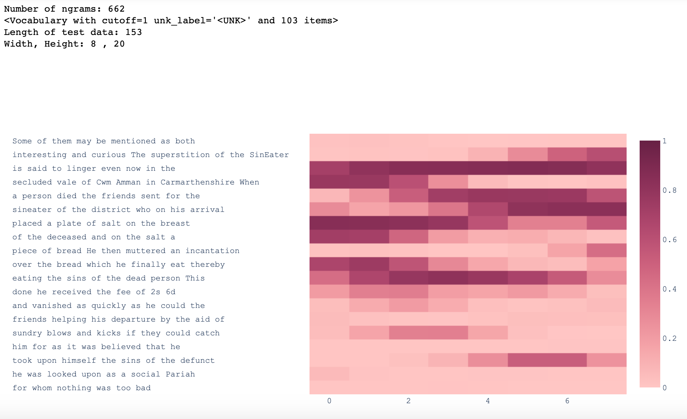

# ouseful-diff-utils

Tools to support text differencing.

This package bundles together (for convenience) several found scripts for displaying differences between small text documents.

## Installation

`pip install git+https://github.com/innovationOUtside/ouseful-diff-utils.git`

## Examples

Check the `examples` directory.

## `diffmatchpatch`

A bundling of the code found at https://github.com/google/diff-match-patch .

The `diffmatchpatch.diff_match_patch()` will identify differences between two texts and then render the differences inline using HTML to highlight addition/deletion.

```python
from ouseful_diff_utils import diffmatchpatch
from IPython.display import HTML

x1 = "This is some text. With some words in it."
x2 = "This is a piece of text. With some different words in it."

# Load diff_match_patch() function
differ = diffmatchpatch.diff_match_patch()

# Find differences between texts
diff = differ.diff_main(x1, x2)

# Render differences
display(HTML(differ.diff_prettyHtml(diff)))
```

Generates output of the form:



## `sidebyside`

A bundling of the code found at https://skeptric.com/python-diffs/ .

The `show_diffs()` function will show the texts aligned side-by-side and highlight the differences in each compared to the other.

```python
x1a="""the superstition of the Sin-Eater is said to linger even now in the secluded vale of Cwm-Aman, in Caermarthenshire. The meaning of this most singular institution of superstition was, that when a person died, the friends sent for the Sin-Eater of the district, who, on his arrival, placed a plate of salt and bread on the breast of the deceased person ; he then uttered an incantation over the bread, after which, he proceeded to eat it, — thereby eating the sins of the dead person ; this done, he received a fee of two-and-sixpence, — which, we suppose, was much more than many a preacher received for a long and painful service. Having received this, he vanished as swiftly as possible, all the friends and relatives of the departed aiding his exit with blows and kicks, and other indications of their faith in the service he had rendered. A hundred years since, and through the ages beyond that time, we suppose this curious superstition was everywhere prevalent.
"""

x2a="""Some of them may be mentioned as both interesting and curious. The superstition of the Sin-Eater is said to linger even now in the secluded vale of Cwm Amman in Carmarthenshire. When a person died, the friends sent for the sin-eater of the district, who on his arrival placed a plate of salt on the breast of the deceased, and on the salt a piece of bread. He then muttered an incantation over the bread, which he finally eat, thereby eating the sins of the dead person. This done, he received the fee of 2s. 6d., and vanished as quickly as he could, the friends helping his departure by the aid of sundry blows and kicks, if they could catch him ; for as it was believed that he took upon himself the sins of the defunct, he was looked upon as a social Pariah for whom nothing was too bad.
"""
from ouseful_diff_utils.sidebyside import show_diffs

show_diffs(x1a.replace('.','').lower(),x2a.replace('.','').lower(),
           'Excerpt from Paxton Hood, *Christmas Evans*',
           'Excerpt from John Murray, *Handbook for Travellers in South Wales*')
```

Generates output of the form:


## Heatmap

A bundling of the code found at https://towardsdatascience.com/simple-plagiarism-detection-in-python-2314ac3aee88

The `heatmap()` function was originally created in order to highlight *similarities* between one text and another as an aid to identifying plagiarised fragaments form onw text in another.

The heatmap display shows areas of the second text where the content is markedly similar to phrases or sentences in the first text.

```python
from ouseful_diff_utils import heatmap

heatmap.heatmap_differ(x1a, x2a)
```

Generates output of the form:

